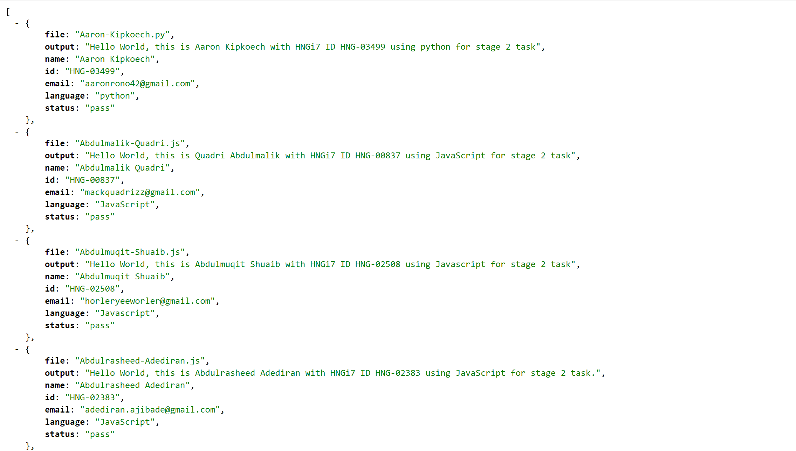

# HNG-SCRIPT:

**This script gets all the files in the scripts folder and runs exec on it, after which it outputs HTML to show a list of passes and failures.**

```**This project is licensed under the terms of the MIT license**```

## Supported Languages

**Javascript | PHP | Python | Java | Dart**

## TO-CONTRIBUTE:

```yaml
Clone Repo:
  https://github.com/dhvakr/HNG-TASK-1.git
```
**Next**
```yaml
Add your intern script to the folder:
  /scripts

Following this format:
  [surname]-[name].[ext]

Example: diva-karan.js,diva_karan.py

Your intern script output must have this format:
Hello World, this is [FullName] with HNGi7 ID [ID] and email [Email] using [Language] for stage 2 task

For Example:
Hello World, this is Divakaran with HNGi7 ID HNG-0045 and email dhvakr@gmail.com using python for stage 2 task

FullName supports up to 4 names.
```


**DON'T ADD YOUR SCRIPT TO THE ROOT DIRECTORY OF THIS PROJECT**
```yaml

    ## To host locally, navigate to Team-Incredible folder in terminal and run
Run:
  php -S localhost:8000 in the HNG-Script folder

Visit the link in the browser that look like:
  http://127.0.0.1:8080/
```

## NOTE:

PHP version 7.3 and above MUST be installed,
Python version 2 and above MUST be installed,
Dart MUST be installed and
Java MUST be installed.

visit https://dart.dev/get-dart to install dart on your local machine.


# RESULT:

This will show a list of all executed scripts and the status.

**Demo Image**
<p align="center">

</p>

## To get a JSON VERSION

```yaml
Add:
  /?json
  
To the end of:
  localhost:8000
  
Example: localhost:8000/?json
```

**Demo Json**
<p align="center">

</p>
